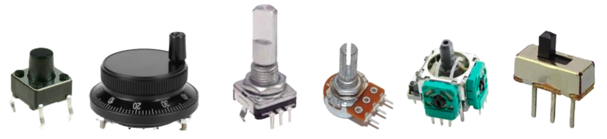

# InputEvents Library
An easy to use but comprehensive Arduino Event Library for both pysical and logical Buttons, Encoders, Encoder Buttons, Analog Inputs, Joysticks and Switches. Tested on Arduino, ESP and Teensy.




Although this library is primarily for physical inputs, all it really cares about is the pin(s). So if you have an on/off input, use an [`EventSwitch`](docs/EventSwitch.md) or for an analog input, use an [`EventAnalog`](docs/EventAnalog.md).

This library is underpinned by Thomas Fredericks' [Bounce2](https://github.com/thomasfredericks/Bounce2) and Paul Stoffregen's [Encoder](https://github.com/paulstoffregen/Encoder) libraries, so many, many thanks to them for releasing their code. Please see notes on PJRC's Ecoder library [here](docs/README.md).

Also a huge thanks to [@kfoltman](https://github.com/kfoltman) for genty guiding me towards 'better' solutions to issues I was having and the 'interesting' approaches I was trying.

I am standing on the shoulders of giants.


**Not heard of the term 'event' programming before?** Here's a quick primer: [Event Programming 101](docs/EventProgramming101.md). It is by far the easiest way to get your project working with external controls.

## INSTALLATION

### Arduino IDE
Install the `InputEvents` and `Encoder` libraries via the Arduino IDE Libary Manager. `Bounce2` should automatically install, but if it doesn't install that too. 


### PlatformIO
Add the following to your `platformio.ini` file:

```
lib_deps = 
	thomasfredericks/Bounce2@^2.72
	paulstoffregen/Encoder@^1.4.4
	stutchbury/InputEvents@^1.0.2`
```

Please see [notes](docs/README.md#notes-on-using-paul-stoffregens-encoder-library) on using PJRC's Encoder library with InputEvents.

## BASIC USAGE

```cpp
#include <EventButton.h>
// Create a button 
EventButton myButton(<YOUR_BUTTON_PIN>);
// Create a callback function
void onButtonCallback(InputEventType et, EventButton& eb) {
  Serial.println("A button event was fired!");
}
void setup() {
    // Link the button's callback to function defined above
    myButton.setCallback(onButtonCallback);
}
void loop() {
    // Call the button's update() method
    myButton.update();
}
```

That's it! A function and three lines of code and you have a button connected and ready to process events.


## Input Classes
There is one class for each type of physical input. All classes have some common methods for handling enable/disable and idle timeout (detailed below).

An overview of the events each input type fires is in the [InputEventType section](#inputeventtype) below with details provided in each the documentation page for each input type.

### [EventButton](docs/EventButton.md)

The [`EventButton`](docs/EventButton.md) class is used with monentary switches or inputs, usually refered to as 'buttons'. 

### [EventEncoder](docs/EventEncoder.md)

The [`EventEncoder`](docs/EventEncoder.md) class is used for plain encoders such as an MPG or motor encoder. If you use this with an encoder button, no button events will be fired!

### [EventAnalog](docs/EventAnalog.md)

The [`EventAnalog`](docs/EventAnalog.md) class is generally used for potentiometers but anything that normally connects to an analog pin will suffice. The analog input value is redefined as 'slices' so events are fire at specified thresholds rather than 1024 times over the range of the input.

### [EventSwitch](docs/EventSwitch.md)

The [`EventSwitch`](docs/EventSwitch.md) class is for plain on/off switches or inputs.

### [EventEncoderButton](docs/EventEncoderButton.md)

The [`EventEncoderButton`](docs/EventEncoderButton.md) class contains an [`EventEncoder`](docs/EventEncoder.md) and an [`EventButton`](docs/EventButton.md). Certain button events are changed is the encoder if pressed and turned. See [InputEventType section](#inputeventtype) below for an overview.

### [EventJoystick](docs/EventJoystick.md)

The [`EventJoystick`](docs/EventJoystick.md) class contains two `EventAnalog(s)`, enabling very easy use of joysicks with 'interesting' resistance values across their range. The joystick will automatically adjust the extent of the analog range, adjusting slices accordingly. Both X and Y axis can be accessed and configured directly if required. 


## InputEventType

The `InputEventType` is an [`enum class`](https://en.cppreference.com/w/cpp/language/enum) using a `uint8_t` to identify the type of event. Some are common to all input, others are specific to a type of input:


- **Common to all Event Input classes**
  - `ENABLED` - fired when the input is enabled.
  - `DISABLED` - fired when the input is disabled.
  - `IDLE` - each class can define its own idle timeout, default is 10 seconds.
 
- **`EventButton`** and **`EventEncoderButton`** classes
  - `PRESSED` - fired after a button is pressed
  - `RELEASED` - fired after a button is released but if an [`EventEncoderButton`](docs/EventEncoderButton.md) is pressed and turned, this is translated to a `CHANGED_RELEASED` event.
  - `CLICKED` - fired after the button is released - use `clickCount()` for double and multi-clicks (no limit!)
  - `LONG_CLICKED` - fired *after* a long press.
  - `LONG_PRESS` - fired *during* a long press (hence change of tense), can optionally repeat.
  Note: If an [`EventEncoderButton`](docs/EventEncoderButton.md) is pressed and turned, `RELEASED`, `CLICKED`, `LONG_CLICKED` and `LONG_PRESS` are not fired.
- **`EventEncoder`** and **`EventAnalog`** classes
  - `CHANGED` fired if an encoder or analog is moved.
- **`EventEncoderButton`** class
  - `CHANGED_PRESSED` - fired when the encoder is pressed and turned.
  - `CHANGED_RELEASED` - fired when button is released after a press and turn.
- **`EventJoystick`** class
  - `CHANGED_X` - fired when the X axis of a joystick is moved.
  - `CHANGED_Y` - fired when the Y axis of a joystick is moved.
- **`EventSwitch`** class
  - `ON` - fired when the switch is turned on.
  - `OFF` - fired when the switch is turned on.

Please see [documentation pages](docs) for more detailed information or chat on [Discord](https://discord.gg/GDcEcWPKKm) if you have any questions.