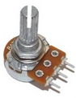
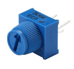

# EventAnalog Class

The [`EventAnalog`](EventAnalog.md) class is for analog inputs - slice an analog range into configurable number of increments. 

For many uses of an analog input, the 1024 'slices' in the analog range are more than is necessary. This library allows you to reduce those 1024 slices to a more managable number, calling a handler function or method each time the slice position increments up or down.

This approach also provides very effective noise reduction.

 


## Basic Usage


```cpp
#include <EventAnalog.h>
// Create an EventAnalog input
EventAnalog myAnalog(A0);
// Create a callback handler function
void onAnalogEvent(InputEventType et, EventAnalog& ea) {
    Serial.print("Analog event fired. Position is: ");
    Serial.println(ea.position());
}
void setup() {
    Serial.begin(9600);
    myAnalog.begin();
    // Link the button's callback to function defined above
    myAnalog.setCallback(onAnalogEvent);
}
void loop() {
    // Call 'update' for every EventAnalog
    myAnalog.update();
}
```

See [example Analog.ino](../examples/Analog/Analog.ino) for a slightly more detailed sketch.


## Event Types

In addition to the [common events](Common.md#common-events) (Enabled, Disabled and Idle) the following event types are fired by EventAnalog:


#### `InputEventType::CHANGED` 
Will be fired on each change of increment.


## Constructor

Construct an EventAnalog
```cpp
EventAnalog(byte analogPin);
```
The `analogPin` parameter *must* be an analog pin. For ESP32 avoid using pins attached to ADC2 (GPIO 0, 2, 4, 12-15, 25-27) as these are shared by the WiFi module.

For most boards this constructor will work fine but if your board has an ADC (analog to digital converter) that is higher than the standard Arduino 10 bits, pass the resolution (in bits) of your board to the contructor:

```cpp
EventAnalog(byte analogPin, uint8_t adcBits);
```
The Arduino Due, Zero, MKR; ESP32, ARM, SAMD & STM32 based boards all use 12 bit ADCs. Teensy boards can use higher bit ADCs but default to 10 bit.

On boards with an ADC greater than 10 bits, the function [`analogReadResolution(bits)`](https://docs.arduino.cc/language-reference/en/functions/analog-io/analogReadResolution/) can be used to change the ADC resolution.

## Class Methods

In addition to the [common methods](Common.md#common-methods) the following are available for EventAnalog:

#### `void update()`

Must be called within `loop()`. See [common methods](Common.md#void-update) for details.


### Setup

Setup methods are typically called from within `setup()` but can be updated at runtime.

#### `void setCallback(CallbackFunction func)`

See [common methods](Common.md#void-setcallbackcallbackfunction-func) for details.


#### `void setNumIncrements(uint8_t)`

Split the analog range into this number of slices. Note: This library is intended to reduce the usual 0-1024 range of `analogRead()` to a much smaller, more manageable number of 'slices'. Higher numbers may not produce accurate results.

An `InputEventType::CHANGED` event will be fired each time the increment changes. 


#### `void setNumNegativeIncrements(uint8_t)` </br>`void setNumPositiveIncrements(uint8_t)`
Normally increments are set with `setNumIncrements` but you can also set the negative and positive sides of 'centre normal' individually.


#### `void setStartValue(uint16_t)`
 Set the underlying analog value that equates to the zero position. Normally used to set the centre for joysticks. 

#### `void setStartBoundary(uint16_t)`
Used primarily for joysticks - it is very difficult to press the joystick button without moving the stick so with this we can create a central 'deadzone'. Parameter in the analog value, not increment position. 

#### `void setEndBoundary(uint16_t)`
Again, used primarily for joysticks to create an outer 'deadzone' where joysticks are notoriously inconsistent. Parameter is the analog value, not the increment position.

#### `void setAdcResolution(uint16_t res=1023)`
Set the ADC resolution for your board. Only use if your board is not the default 1023 resolution or you are testing a 5V UNO board with a 3V3 input (675)!
Note: All resolutions are internally mapped to 0-1023 before being sliced.

#### `void setRateLimit(uint16_t ms)`
The EventAnalog callbacks are normally fired every time the position changes but to limit the number of events fired when the potentiometer is moved quickly, you can set a rate limit here. Note: A high rate limit may reduce responsiveness.

#### `void reversePosition(bool rev=true)`
If your position is coming out backawards (negative) You can set this rather that rewire your input.

#### `bool isPositionReversed()`
Returns true if position is reversed.


#### `void allowRead(bool allow=true)`
EventAnalog will adjust the top & bottom extent of the analog range during use, even when the input is disabled. Set this to `false` to turn off when disabled.


### State

#### `int16_t position()`
Returns the current position - this is not the analog value but the mapped position of the increments you have defined. Can be negative if `setStartValue` is greater than the minimum position (eg for joysticks).

#### `int16_t previousPosition()`
Returns the previous position - this is not the analog value but the mapped position of the increments you have defined.

#### `bool hasChanged()`
Returns `true` if position has changed since previous `update()`.

