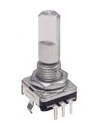

# EventEncoderButton Class

The `EventEncoderButton` class combines the `EventEncoder` class with the `EventButton` class and  is used for the common encoder buttons.


The class provides all the encoder events with the addition of `CHANGED_PRESSED` which is fired when the encoder is pressed and turned. 

All the `EventButton` events are also fired but if the encoder is pressed and turned the following changes to events occurs:

- on release, the button's `RELEASED` event is translated to a `CHANGED_RELEASED` event.
- the `LONG_PRESS` is not fired.
- Neither `CLICKED` or `LONG_CLICKED` are fired.

When the encoder is not pressed and turned, its button behaves just like a regular `EventButton`.





## Basic Usage

Note: In the Arduino IDE, you must explicitly `#include <Encoder.h>` before `EventEncoderButton.h`. In PlatformIO, InputEvents will include it for you if you have PJRC's Encoder library installed in your project.

```cpp
#include <Encoder.h>
#include <EventEncoderButton.h>
// Create an EventEncoderButton input
EventEncoderButton myEncoderButton(2,3, 7); //First two should be interrupt pins
// Create a callback handler function
void onEncoderButtonEvent(InputEventType et, EventEncoderButton& eeb) {
    Serial.print("Encoder button event fired. Position is: ");
    Serial.print(eeb.position());
    Serial.print(" Pressed position is: ");
    Serial.println(eeb.pressedPosition());
}
void setup() {
    Serial.begin(9600);
    // Link the encoder button's callback to function defined above
    myEncoderButton.setCallback(onEncoderButtonEvent);
}
void loop() {
    // Call 'update' for every EventEncoder
    myEncoderButton.update();
}
```

See [example EncoderButton.ino](../examples/EncoderButton/EncoderButton.ino) for a slightly more detailed sketch.


## Event Types

In addition to the [common events](Common.md#common-events) (Enabled, Disabled and Idle) and the `EventEncoder` & `EventButton` events, the following event types are fired by EventEncoderButton:


#### `InputEventType::CHANGED_PRESSED` 
Will be fired on each change of encoder increment is pressed and turned.

#### `InputEventType::CHANGED_RELEASED` 
Will be fired in place of the button's `RELEASED` event if the encoder is pressed and turned.


## Constructor

Construct an EventEncoderButton
```cpp
EventEncoder(byte encoderPin1, encoderPin2, buttonPin);
```

## Class Methods


    long pressedPosition();


In addition to the [common methods](Common.md#common-methods) the following are available for EventAnalog:

#### `void update()`

Must be called within `loop()`. See [common methods](Common.md#void-update) for details.


### Setup

Setup methods are typically called from within `setup()` but can be updated at runtime.

#### `void resetPressedPosition(long pos = 0)`
Reset the counted position of the encoder. 

Please see [`EventEncoder` setup](EventEncoder.md#setup) and [`EventButton` setup](EventButton.md#setup) documentation for details about the other setup methods.

### State

#### `long pressedPosition()`
The current pressed position of the encoder. Can be reset by `resetPressedPosition()`.


Please see [`EventEncoder` state](EventEncoder.md#setup) and [`EventButton` sstate](EventButton.md#setup) documentation for details about the other state methods.


